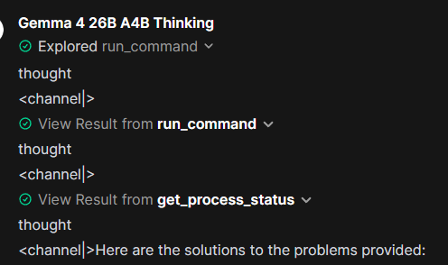
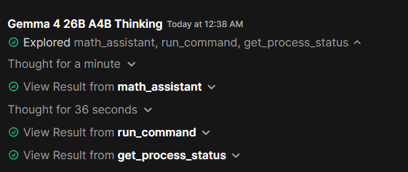

# Gemma 4 Chat Template (llama.cpp / OpenWebUI)

Custom Gemma 4 chat template designed for use with **llama.cpp** and **OpenWebUI**.

## Overview

This template is based on the newer official Gemma 4 format, but modified to fix an issue where reasoning-channel tokens such as `thought` and `<|channel>` could leak into visible outputs.

The goal is to:
- Keep modern tool-calling behavior
- Maintain compatibility with `llama.cpp`
- Prevent thinking-channel leakage in responses

## Example

### Before (broken output)



### After (fixed output)



## Changes from the Official Template

- Removed replay of:
  - `message.reasoning`
  - `message.reasoning_content`
- Removed forced empty:
  - `<|channel>thought ... <channel|>`
- Kept:
  - tool-call handling
  - tool-response formatting
  - assistant continuation logic

## Why This Exists

The official Gemma 4 template assumes a serving stack that properly handles reasoning channels.

In some setups, such as `llama.cpp` with `OpenWebUI`, those markers may appear in the final output. This template removes the problematic parts while keeping the newer tool and message flow intact.

## Usage

Replace your current chat template with the modified version.

Tested with:
- `llama.cpp` (`peg-gemma4`)
- `OpenWebUI`
- **Gemma 4 26B (Bartowski GGUF)**

## Notes

You may still see this warning in `llama.cpp`:

```text
common_chat_try_specialized_template: detected an outdated gemma4 chat template, applying compatibility workarounds. Consider updating to the official template.